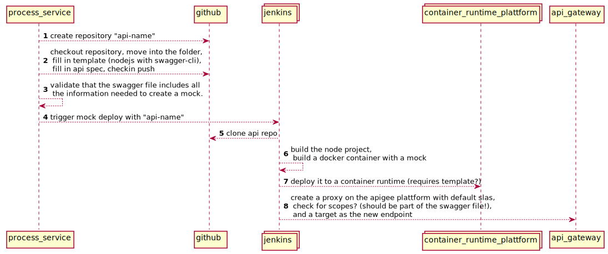

# API automation

This repository includes all the assets that are needed to automate the API Process: 

# Scope

1. Create Github Repository with the name of the API 
2. Create the content for the repository
  1. Nodejs template including the swagger-ui files
  2. Add the "uploaded" swagger specification
  3. then commit
3. Deploy a mock / sandbox api
  1. build and deploy the api automatically based on the swagger spec (can that be done in nodejs otherwise use python) 
  2. create a apigee proxy for the api (sandard slas, ...)
4. Create automatic documentation for the api with widashins
  1. Create a new "api-name-docs" repository
  2. Create add the specification to the repository
  3. Generate the specification and check it in
  4. Genrate a docker container with a static page for the api
  5. Deploy the docker container for the api

Next steps:
1. Developer clone the repository and create a pull request with an implementation
2. This then updates the mock api
3. When to release to production?
4. When and how to request security approval? How to check this in github? How to notify security that something needs to be done? Ticket like @Amazon (Create a github issue with them as responsible person? / gruppen postkorb?)

Feedback Schleifen zwischen Kunden & Anforderer

# Sequence

